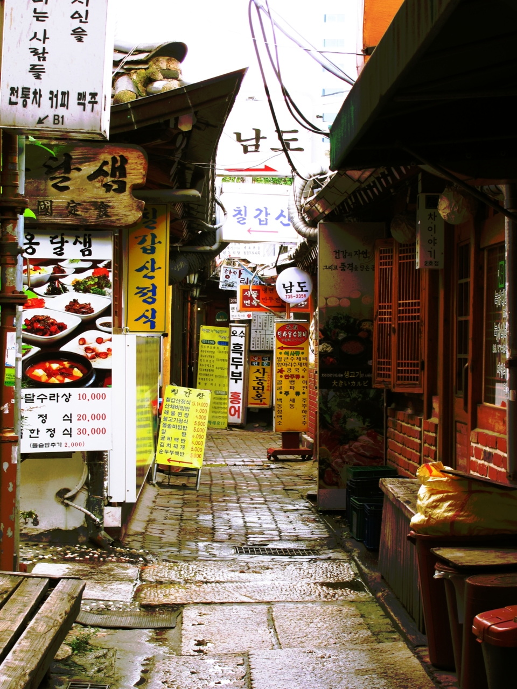
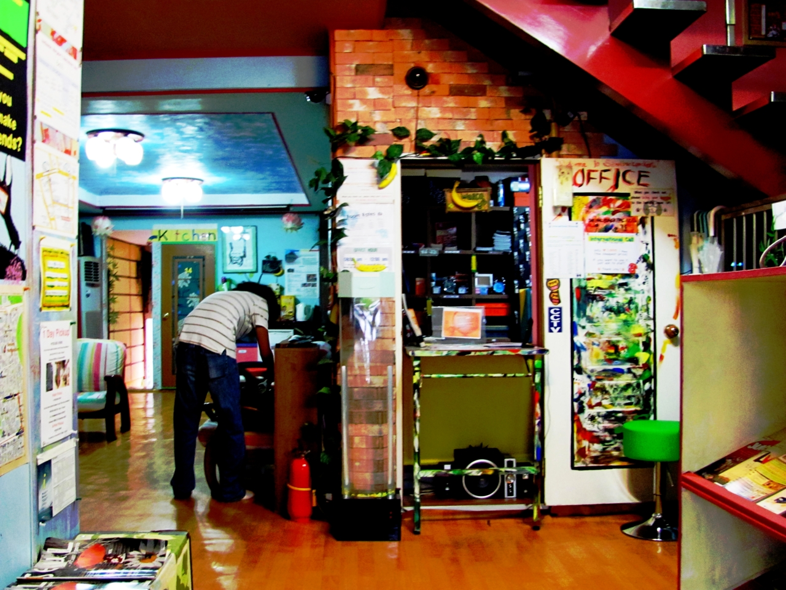

La primera noche que dormimos como la gente normal en Seoul fue jueves 26 de agosto.
La verdad es que quedé muy contento con el lugar que nos habían recomendado en el centro
de atención turística, pues el lugar estaba muy limpio agradable y como dicen en el Distrito
Federal: traía ondita. El lugar se llama Banana Backpackers y está cerca de la estación Anguk(안국역),
un lugar muy cercano a varios lugares turísticos en Seoul. Ahí puedes encontrar todo tipo de souvenirs,
baratos en general y algunos restaurantes de precios muy accesibles.

<cite>
  Callejón con comida en Anguk-dong (안국동).
</cite>

<cite>
  Banana Backpackers Hostel
</cite>

Cerca el hostal caminamos sin destino alguno y con él único propósito de encontrar un lugar donde alimentar
nuestras ya rumiantes tripas. No quisimos pedir ningún tipo de  referencia para agregarle un poco de misterio
a nuestra jornada. A veces creo que las mejores cosas de la vida son las que te toman por sorpresa no importando
si sean buenas o malas. Prefiero también tener una dósis ocasional de las malas porque en general te vuelves un
poco menos exigente con la vida y puedes ser feliz sólo con lo necesario. Afortunadamente el destino nos puso
una jugada “de pechito” y encontramos un muy buen lugar a un par de cuadras de ahí.

Ya sabes es ese callejón que a veces ves en fotos que por su angostura jurarías que los orientales viven
unos encima de otros. Ahí realicé lo que fue mi primera comida coreana cocinada en Corea, ya que la
hamburguesa de Bulgogi (불고기 버거) que comí en McDonalds del aeropuerto de Incheon no cuenta. Lo que
comí ahí  fue Kimchi jjigae(김치찌개) que estaba muy picoso y caliente. Naturalmente como la mayoría de
las sopas en Corea nos la llevaron a la mesa aún hirviendo, pero aún así tratamos de comerla de inmediato.
Ya por estos días en los que cumplo ya casi tres meses aquí la comida caliente ya no representa para mí un problema.

Más adelante salimos a caminar y nos encontramos con un par de coreanos que dicen que aman México y venden dulces,
que en coreano se llaman barbas de azúcar. Vean la historia de como se hacen esos dulces.

`youtube:https://www.youtube.com/embed/xCHnOkXEC1E`
<cite>
  Korea Medley
</cite>

Noé.
