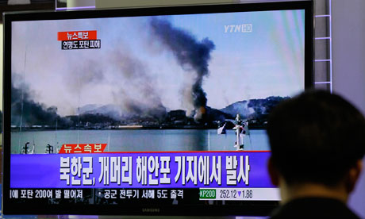
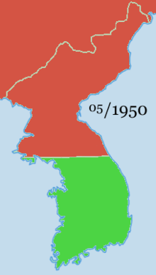

En este momento algunos puede estarse preguntando sobre lo que está pasando en Corea del Sur y la impresión que tuve sobre lo que pasó.
Yo estaba saliendo de mi clase de Inteligencia Artificial, acababa de tener un examen de hora y media y no había desayunado.
Salí del edificio del departamento de Ciencias Computacionales para ir a comer en la cafetería favorita Ramen de Queso (치즈라면).
En el camino me topé a mi amigo mexicano que también está de intercambio y se unió a mi plan. Veníamos platicando sobre lo demandante
que han sido nuestras clases estos días, que mi examen de inteligencia artificial había estado difícil, largo, fue un verdadero reto,
para él que su clase de Física Moderna acababa de pedirle sutilmente estudiar en su fin de semana y hacer tarea. Caminabamos a través
e la cafetería del E11, que es la mejor cafetería para mi gusto, la comida tiene muy buena calidad y siempre buena variedad .
Ibamos llegando a la caja cuando vi una imagen como esta:

<cite>
Así vimos la televisión.
</cite>

Sin pensarlo le dije, a mi compinche, mirá el Pearl Harbor Coreano “jajajaja”, reímos sarcásticamente. Al llegar a la fila de los fideos,
nos encontramos con que ya se había terminado la hora de servir, el límite era las 4 de la tarde. Pero la señora que los prepara le pidió
a la cajera que nos vendiera todavía a nosotros y a una persona más, definitivamente élla se va a ir al cielo. Comimos, platicamos, reímos,
hasta que volvimos a los dormitorios.
Ya de vuelta al dormitorio al encender mi computadora me encontré con unos twitts que decían, que me saliera y me preguntaban si estaba bien.
Gracias por la preocupación a  @PorrasMD @luion y @hectorgr. Abrí uno de los links que me mandaron y fue cuando me di cuenta que Norcorea,
sin razón alguna comenzó a atacar territorio surcoreano.

El conflicto de las coreas ha estado latente desde el fin de la segunda guerra mundial y es el heredero principal de la guerra fría.
Corea del norte se encuentra totalmente cerrado al mundo entero y a cualquier negociación, ya que durante la última década ha violado
acuerdos en varias ocasiones. Nos ha visto la cara de tontos a las Naciones Unidas. Algunos de estos sucesos son mencionados por el periódico El País:

<strong>2002 – Planes secretos</strong> – En junio de 2002 los servicios de inteligencia de EE UU descubren que Pyongyang intenta comprar equipamientos para
enriquecer uranio en lugar de plutonio. En octubre se confirma que Corea del Norte tiene un programa secreto de enriquecimiento de uranio.
El régimen anuncia que retomará las actividades del reactor de Yongbyon y expulsa a los inspectores del Organismo Internacional para la Energía Atómica (OIEA).

<strong>2003 – Diálogo a seis</strong> – Corea del Norte acepta sentarse a la mesa de negociaciones con EE UU, Corea del Sur, Japón, China y Rusia para
discutir un programa de desarme. En septiembre de 2005, pacta un plan de desarme a cambio de ayudas. Un día después el régimen se retracta.

<strong>2006 – Primera prueba nuclear</strong> – En octubre, Corea del Norte realiza su primer prueba nuclear desatando la alarma internacional.

<strong>2007 – Vuelta a la negociación</strong> – En febrero, Corea del Norte acepta otra vez paralizar su programa nuclear a cambio de ayudas.

<strong>2008 – Nueva marcha atrás</strong> – En junio de 2008, Pyongyang anuncia el desmantelamiento de sus instalaciones nucleares y vuela la
torre de refrigeración del reactor de Yongbyon. Pero revoca la decisión dos meses después. En mayo de 2009, Pyongyang lleva a
cabo su segunda prueba nuclear: una explosión atómica subterránea de una potencia similar a la de la bomba atómica lanzada por
Estados Unidos sobre Nagasaki.

Durante este año ha habido otras contundentes provocaciones Norcoreanas, hace algunas semanas que se llevó a cabo el G20 en Seúl
y hubo intercambio de fuego entre torres de vigilancia que sumaron en total 5 disparos. No olvidemos el hundimiento del submarino
en el cual murieron 46 tripulantes en marzo del cual Norcorea se deslinda de toda responsabilidad a pesar de la evidencia de un
torpedo disparado. Y ahora  dispara cerca de 170 proyectiles de artillería a la isla de Yeonpyeong, una semana después de que se
descubriera lo que podría ser una planta de enriquecimiento de Uranio. Varias fuentes informativas infieren que el motivo detrás
las acciones militares es la sucesión de Kim Jong-Un al poder. Propaganda Gubernamental.

Cabe destacar que el gobierno surcoreano ha sido el que ha cedido a toda costa para terminar esta guerra de una vez por todas.
Este año mandó apoyos para las víctimas de las inundaciones que ocurrieron en verano. Promovió conjuntamente con la Cruz Roja el
reencuentro de familias separadas por la guerra. El presidente de Hyundai Chung Ju Yung prometió hace varios años la construcción
de un complejo industrial y una línea de tren nueva que uniría a las Coreas. Durante previos acuerdos de desarme se han proveído
aprox. 1,200,000 toneladas de arroz (sí, otla vez aloz…) y recientemente se lanzó la propuesta de realizar una candidatura
conjunta para la copa del mundo del 2022.

El clima Surcoreano sobre las injurias Norcoreanas de ayer es un poco tenso, no hay un sentimiento generalizado de que esta vez
pudiera estallar la guerra. Pero es numeroso el grupo que lo concibe. Algunos lo ven con indiferencia, pues la gente piensa que
Norcorea ha estado solamente fingiendo tener poder. El concebir una vez mas una posible guerra en la que se vuelvan a encontrar
potencias como EEUU y China podría ser catastrófico. Recordemos que durante la guerra de Corea el ejercito americano en conjunto
con el Surcoreano e Inglés tomaron toda la península en 1950. Hasta que el gobierno de la República Popular de China  intervino
a favor de Corea del Norte. Las vidas perdidas rojas fueron aproximadamente 1,200,000 personas contra 750,000 verdes.

Yo creo que dar un poco esperanza al mundo con una solución pacífica a este conflicto podría ser la mejor solución. Durante esta
primera década del nuevo milenio solamente hemos escuchado de guerra, crisis, crímenes, separación, desolación. Este podría ser el
último rayo de esperanza para reunificar a Corea no solo como  estado, sino también como sociedad a través de la reunión de las
familias. Las personas cuyas familias fueron separadas en 1953 se encuentran en la tercera edad y podrían ser muy probablemente
el último eslabón para la plena reunificación de esta península.

Foto: Flickr/bcgovphotos
