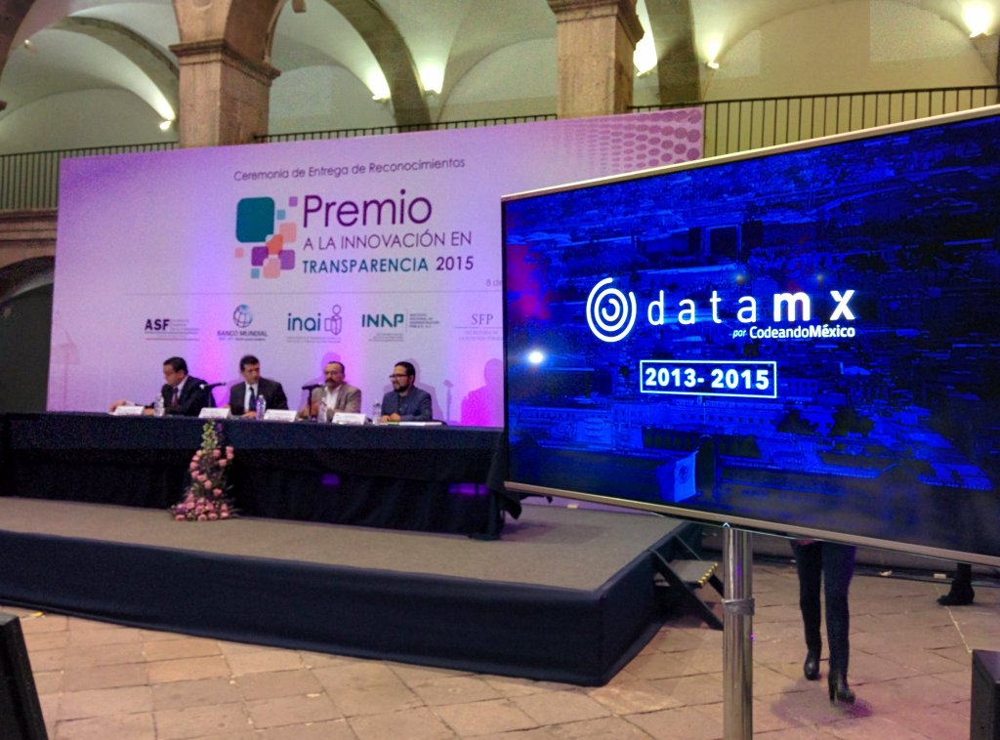
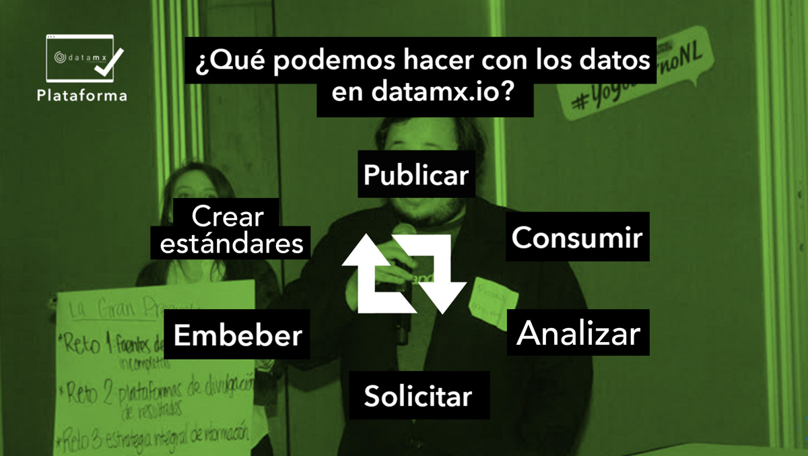
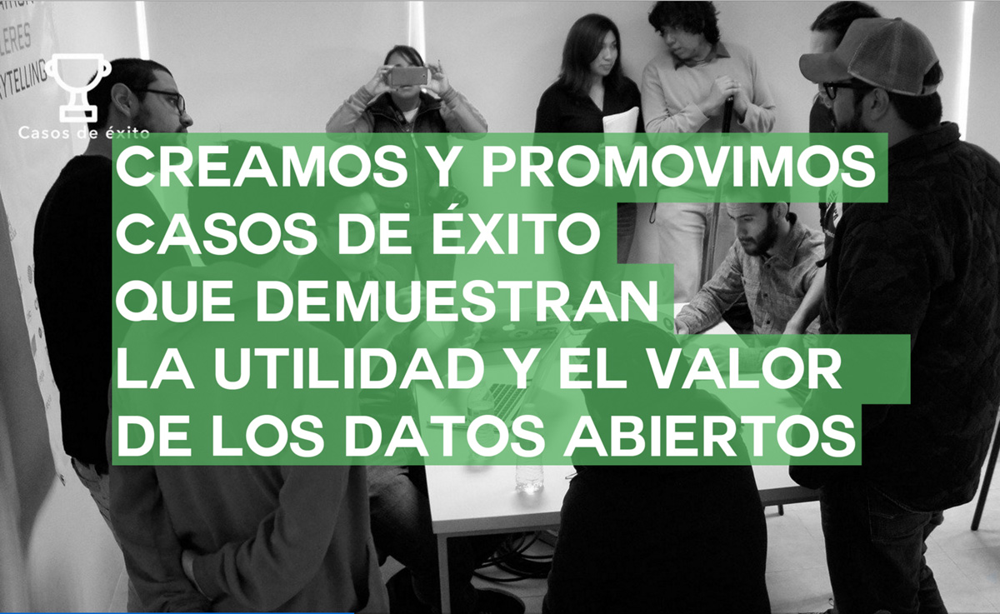
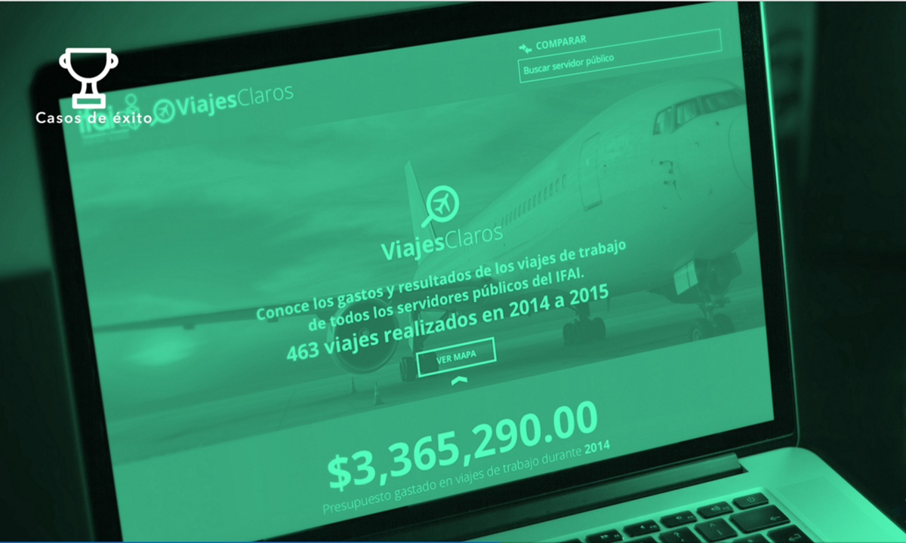
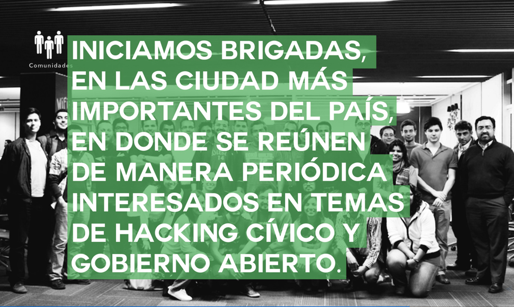

Hoy presentamos [Datamx](http://datamx.io) en el Premio a la Innovación en Transparencia 2015 en donde nos fue otorgado el primer lugar en la categoría de Personas Físicas y Asociaciones Civiles. Fue un honor poder compartir parte de la experiencia que aprendimos en alrededor de 2 años de trabajo y quisimos hacer énfasis en contar la historia de [Datamx](http://datamx.io) no en el fin hasta donde ha llegado, si no por los principios de los que partió y de las historias que hemos documentado, hay mucho que contar.

Estuvimos un par de años en contacto continuo con Gobierno, sociedad civil y ciudadanos interesados en cambiar su entorno, principalmente nos involucramos juntos en nuevas maneras de llevar innovación a nuestra sociedad de manera cívica. Cabe destacar que Codeando México y por lo tanto [Datamx](http://datamx.io) parten de 3 grandes pilares que dan forma a nuestro trabajo:
- La innovación abierta.
- El acceso a información a través de datos abiertos.
- La creación de herramientas de código que promueven la colaboración en práctica.

[Datamx](http://datamx.io) logró desarrollar una solución orgánica de lo que los ciudadanos necesitaban, siempre ha estado en nuestra filosofía el construir herramientas con los ciudadanos y no para ciudadanos, promovemos un flujo creativo que incluye al usuario. [Datamx](http://datamx.io) lleva el mismo en su mantra.

Una muestra de eso es que cuando [Datamx](http://datamx.io) nació solo tenía el objetivo de publicar y consumir datos. Posteriormente generamos un flujo de publicación y consumo de datos para la ciudadanía que involucró crear el [Centro de Apertura de Datos](http://apertura.datamx.io), donde se pueden solicitar datos para su apertura así como analizar el pulso de qué es lo que demanda la ciudadanía. Más allá de los lineamientos técnicos de los datos abiertos nos dimos cuenta que la ciudadanía demanda *datos oportunos*.

## Los estándares de datos

La mejor manera que [Datamx](http://datamx.io) pudo haber conseguido a sus primeros aliados fue a través de colaborar con Asociaciones Civiles, ellas tienen conocimiento específico y especializado muy valioso, es por eso que se abrió un canal para proponer estándares de datos. En principio, se privilegia a la discusión de manera abierta, así como también se promueve que sea una referencia compartida tanto en México como América Latina. Si te gustaría conocerlo puedes verlo en [estándares.datamx.io](http://estandares.datamx.io).

## Las aplicaciones cívicas

Otro de los temas que nos entusiasman son las aplicaciones cívicas, se crearon algunas con fines informativos o se usaron para crear soluciones cívicas. Uno de los proyectos que a veces tomamos como ejemplo es la aplicación Viajes Transparentes, que se hizo con el entonces Instituto Federal de Acceso a la Información Pública, ahora INAI. De ahí nos gustaría destacar un cambio de cultura que ocurre para las nuevas adquisiciones de software:

- El uso de datos abiertos para aplicaciones ahora es un elemento de valor.
- El uso de código abierto y tecnología abierta también se promueve.
- Se procura involucrar equipos más pequeños que tienen propuestas valiosas, lo que lo hace más inclusivo.
- El Código Abierto por defecto se promueve en vía de un efecto multiplicador y de reutilización en otras instituciones.

## Las comunidades de hacking cívico
Codeando México encuentra grupos de ciudadanos y mentes motivadas que quieren cambiar la colectividad y la ciudadanía. En el Gobierno los grupos se mueven en jerarquías, en contraste, estos grupos de ciudadanos se mueven en estructuras parecidas a las redes. Ellos participan con un enfoque de colaboración en práctica y dirigidos hacia una meta común. Estos ciudadanos probablemente se conocen gracias al Internet pues las comunidades temáticas son más fáciles de encontrar. Las Comunidades de Hacking Cívico son exactamente ese lugar donde se puede conocer a otros perfiles con el mismo interés cívico en persona. Algunos de los eventos que hicimos en conjunto con las Comunidades de Hacking Cívico y la comunidad en línea fueron la [Carrera Open Data MX 2015](http://blog.codeandomexico.org/2015/04/13/ganadores-carreraopendatamx/), el [Censo de Datos Abiertos](http://blog.codeandomexico.org/2014/12/12/open-data-census-ciudades/), hackatones y Civic Hack Nights.

[Datamx](http://datamx.io) como sistema se diluye entre la comunidad, la comunidad es la gran constructora del significado que tiene la plataforma. Quedó en la ceremonia que este ha sido una pequeña parte del camino que hemos recorrido y que podemos compartir. Más importante aún, permanecerá en el recuerdo el mensaje de que hay muchos ciudadanos interesados en la mejora del entorno y que quieren colaborar, que la transparencia es mejor cuando nos es útil y que hoy es un gran día que celebramos con ustedes.

Post originalmente escrito para [Codeando México](http://blog.codeandomexico.org).

Foto de [TomHall NZ](https://www.flickr.com/photos/tom_hall_nz/17004434418/).
