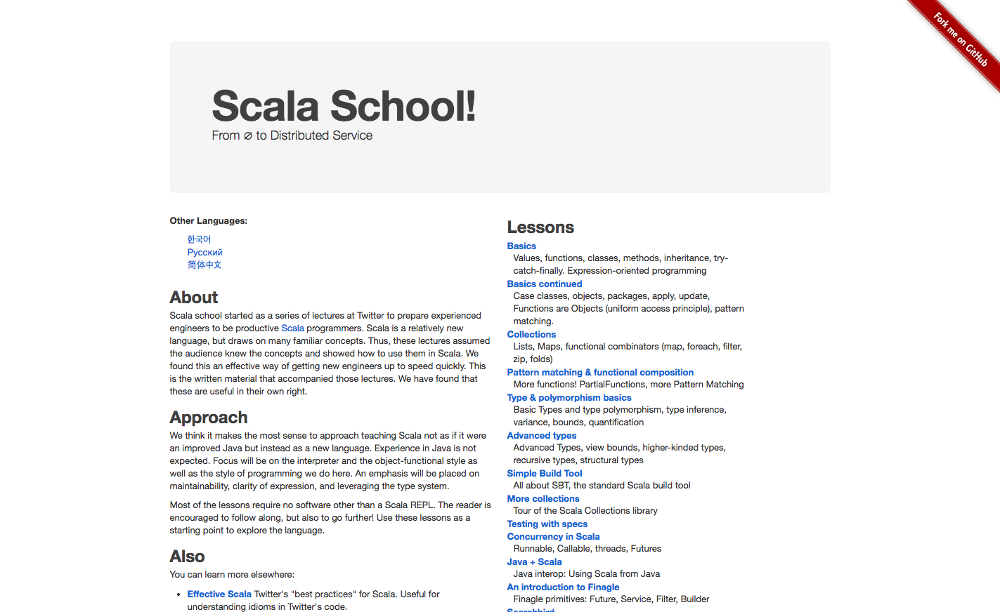

<cite>
  Scala School un tutorial rápido a Scala
</cite>

Este post es para informarles que iniciamos la traducción del tutorial de [Scala School de Twitter](https://twitter.github.io/scala_school/).
El tutorial de Scala School incluye una rápida introducción al lenguaje en 13 secciones:

- Basicos
- Continuación de básicos
- Collecciones
- Coincidencia de patrones & composición funcional
- Tipos y los básicos de polimorfismo
- Tipos avanzados
- Simple Build Tool
- Más sobre collecciones
- Testing con specs
- Concurrencia en Scala
- Java + Scala
- Introducción a Finagle
- Searchbird

Si quisieran cooperar en la traducción del tutorial hay issues abiertos en [nuestro fork de 
Scala School](https://github.com/scalamx/scala_school/issues) en Github. Pueden tomar cualquiera que no tenga una persona asignada, los invitamos 
a participar.

__Originalmente posteado en scala.org.mx__
