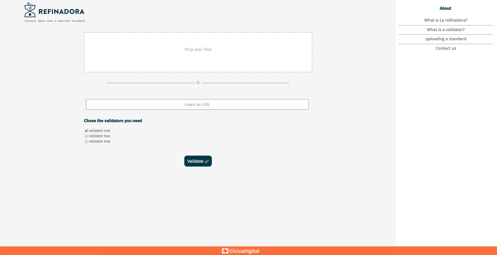
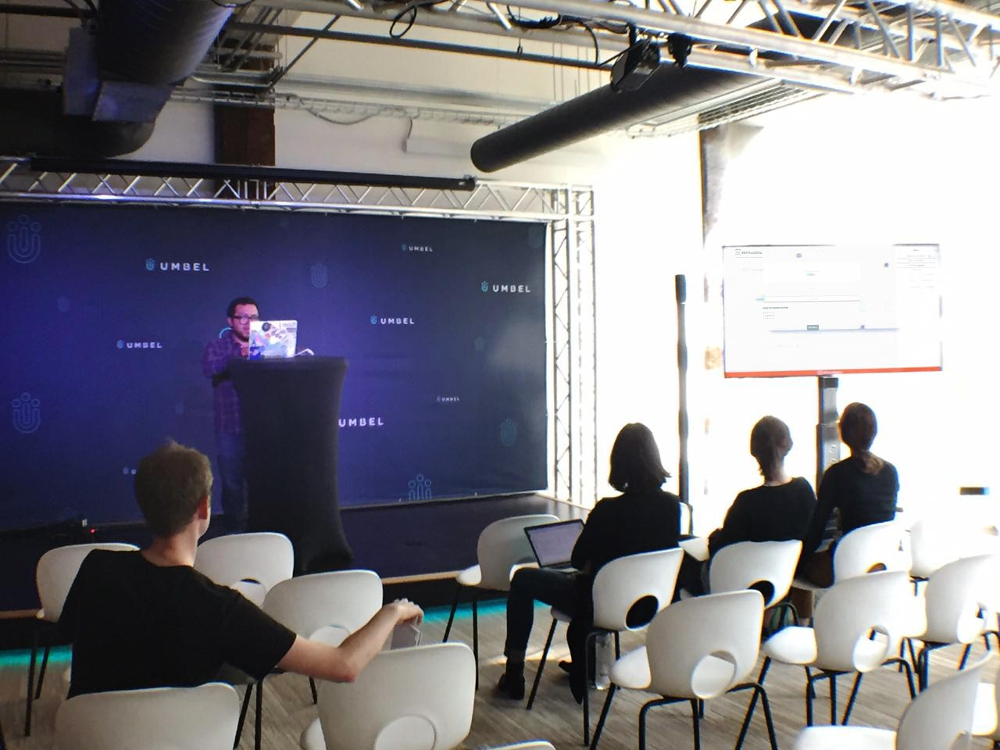

__Inteligencia y automatización para las salas de prensa__

El día 18 y 19 de abril tuvimos la oportunidad de asistir a un evento patrocinado por la Mozilla Foundation y la Knight Foundation: La Reunión de Código de [Open News 2016  en Austin, TX](https://source.opennews.org/en-US/articles/when-bots-get-together-part-1/). Esta iniciativa consiste en crear soluciones de Software de Código Abierto para equipos de periodismo. Los equipos fueron seleccionados para desarrollar sus proyectos a través de Internet y fuimos el primer equipo internacional en participar en la dinámica. Cabe destacar que los participantes del evento venían de distintos contextos, algunos de Radios Públicas Nacionales (NPR), The New York Times, periodistas investigadores, The Marshall Project -que cubre el Sistema de Justicia de Estados Unidos y durante el evento ganaron un Pulitzer-, periodistas independientes, entre otros. Todos en una dinámica parecida a un hackatón donde la colaboración y trabajo intensivo de dos días se materializó en avances de un proyecto de código abierto que ayudará a la automatización de las salas de prensa de Estados Unidos y seguramente México.

Una de las cosas que personalmente me gustó es que el evento está enfocado en probar  una nueva manera de hacer más efectivos los hackatones, con proyectos que ya han iniciado y necesitan retroalimentación para continuar su desarrollo. Al mismo tiempo que el evento fue como una mini-conferencia porque hubo tiempo para compartir retos en: el periodismo, análisis de datos y la administración de la tecnología en los portales de noticias. Compartir experiencias de manera abierta sobre buenas prácticas y especialmente la solución a problemas en común fue una de las experiencias más enriquecedoras para todos los equipos.

Los proyectos notablemente se enfocaron en dos vías temáticas: Recolección, y uso de información y automatización de reportes con métricas para portales a través de bots. Neil, un programador independiente que aún no trabaja en ningún equipo de periodismo, hizo un generador automático de Podcasts a partir de texto. Es como programar un bot que convierta las noticias en audio. La automatización y el uso fiable de información fue el eje rector de todos los equipos.

<cite>
Diseño de Sandra Barrón
</cite>

El equipo de Cívica Digital: Sandra Barrón como Diseñadora de producto, Miguel Morán a.k.a. Mikesaurio y un servidor como desarrolladores de software asistimos con la propuesta de [La Refinadora](https://github.com/civica-digital/la-refinadora). Este proyecto lo iniciamos con la organización de [México Abierto](https://github.com/mxabierto) y  tenemos interés en seguir desarrollándolo de manera colaborativa. La Refinadora, es un proyecto que te ayuda a validar datasets conforme a un formato estándar. Esto quiere decir que si tienes información en algún formato abierto, como un CSV, puedes validar: que las fechas estén conforme al estándar ISO-8601, que un CSV cumpla con su formato, podrías incluso validar una codificación, entre otras validaciones y formatos de información.

La importancia de La Refinadora consiste en que necesitamos ayuda para mejorar la calidad de los conjuntos de datos. Hace un par de años teníamos, quizá, un dilema sobre cómo poder ayudar a que hubiera una estrategia de Datos Abiertos, cómo ayudar a que se pudiesen publicar esos datos y que la comunidad los usara. Pero en el tema técnico, en este momento, es relevante ayudar a que la información sea homogénea, que se conforme con estándares y a que lo puedas hacer de manera masiva y automática en cualquier lenguaje. Incluso hay autores como McCallum y Gleason en 'Business Models for the Data Economy' (O'Reilly Media, 2012) que aseveran que uno de los nichos económicos con los que se puede crear valor con datos es el de _Filtrar y Refinar (datos)_ para que los clientes de nuestra información puedan confiar. Así, analistas de datos, negocios y periodistas, pueden usar la información proveniente de fuentes de Datos Abiertos con seguridad. Y para quien no confían en la fuente entonces serviría para que puedan verificarla.

La Refinadora fue pensada en estos principios y es por eso que cuando se diseñó por primera vez se consideró la posibilidad de utilizar contenedores con Docker, para crear entornos aislados para la ejecución de scripts en distintos lenguajes. Hemos detectado varios lenguajes, dependiendo del equipo que trabaje la información. Empero, si necesitas utilizar Clojure, entonces utiliza una imagen de Docker que tenga la JVM. Si necesitas ejecutar tu script con Python, entonces usa una imagen que tenga configurado un intérprete de Python y que todas sus utilerías o dependencias sean configurables. Debe ser fácil ofrecer un entorno de ejecución diverso para las entidades que necesitan diversidad y al mismo tiempo ser estándar, las posibilidades con contenedores se expanden y cada vez son más accesibles.

<cite>
La nueva interfaz que diseñamos para La Refinadora e implementada por Mikesaurio y Sandra
</cite>

La interfaz, detectamos con los usuarios, debe de ser plural y disponible para distintos perfiles de usuario técnicos en la programación y otros no tanto. Es por eso que, además de una interfaz para hacer ingesta por Catálogos de Datos en formato [DCAT](https://www.w3.org/TR/vocab-dcat/), que ya es usada por [defecto en La Unión Europea](https://joinup.ec.europa.eu/asset/dcat_application_profile/description) y [México](http://www.dof.gob.mx/nota_detalle.php?codigo=5397117&fecha=18/06/2015), creamos ahora una interfaz para subir archivos por web de manera sencilla. Ahora podrás arrastrar tus archivos desde una carpeta a la interfaz web y seleccionar los verificadores. Con esto mejoramos la accesibilidad para tareas no automatizadas y usuarios de perfiles no tan técnicos.

<cite>
En la presentación de los demos
</cite>

La experiencia fue enriquecedora, porque trabajamos con periodistas e informáticos en este tema y fue increíble haber conocido a uno de los creadores de [Tábula](http://tabula.technology/), que ya tiene una larga historia entre quienes comenzamos a liberar datos de PDFs. Sin embargo, nos queda claro que este tipo de reuniones especializadas sirven para hacer camino con nuevas herramientas para el procesamiento de información, que puedan servir a las tareas de: Análisis de Datos, Periodismo de datos y visualización de datos. Este sigue siendo una tarea muy especializada y hay que seguir desarrollando proyectos que puedan ayudar a esta importante tarea.

Te invito a que revises el repositorio de La Refinadora en [github.com/civica-digital/la-refinadora](https://github.com/civica-digital/la-refinadora). Por el momento creamos también una nueva documentación en Inglés para que desarrolladores de todo el mundo puedan ayudarnos a mejorar el primer diseño. Si sabes Python, Docker y te interesa esta herramienta para Datos Abiertos te invitamos a escribirnos  en Github y si vas a Pycon-US 2016 te esperamos en los Sprints.

Noé Domínguez([@poguez](https://github.com/poguez))

Foto de portada de Sandra Barrón
[Post originalmente escrito para el [blog](http://blog.civica.digital) de Civica.digital]

